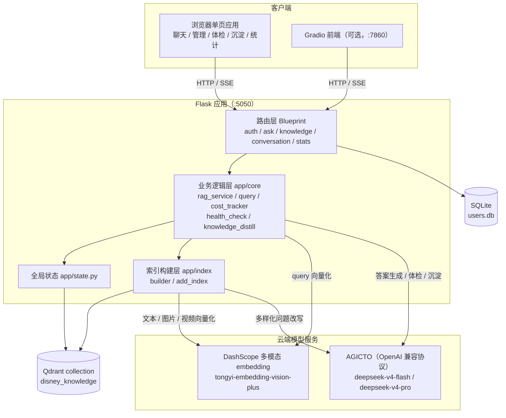

# 多模态数据处理 RAG

<p align="center">
<b>多模态知识库检索增强生成工程实践 —— 迪士尼客服助手</b><br/>
<em>Multimodal RAG in action: a Disney customer-service assistant that retrieves and reasons over text, images and video.</em>
</p>

<p align="center">

<!-- 徽章说明：Tests / Last Commit 为静态占位徽章，推送 GitHub 并接入 CI 后替换为动态徽章：
     CI:   https://img.shields.io/github/actions/workflow/status/<owner>/<repo>/ci.yml?label=tests
     Last: https://img.shields.io/github/last-commit/<owner>/<repo> -->

[](LICENSE)
[](https://www.python.org/)
[](docker-compose.yml)
[](#roadmap)
[](docs/)
[](#)

</p>

---

## 项目简介

以「迪士尼客服助手」为业务场景的检索增强生成（Retrieval-Augmented Generation）示例工程：文本、图片、视频通过 DashScope 多模态 embedding 模型统一向量化并存入 Qdrant，问答时检索相关片段交由 Chat LLM 生成答案，并自动附带匹配的图片或视频。管理员侧配套知识库健康检查、对话知识沉淀、成本追踪等运营能力，长耗时任务全部通过 SSE 流式推送进度。

- **多模态统一检索**：文本（docx）/ 图片 / 视频共用同一向量空间与同一 Qdrant collection。
- **工程化运营闭环**：体检、重建、沉淀、成本统计一应俱全，适合作为多模态 RAG 的落地参考。
- **一条命令启动**：Docker Compose 同时编排 Flask 应用与 Qdrant 服务端，开箱即用。

## 系统架构

整体分为五层：浏览器单页应用（含可选 Gradio 前端）、Flask 路由层（Blueprint 拆分）、业务逻辑层（`app/core`）、索引构建与存储层（Qdrant / SQLite）、外部模型服务（DashScope embedding 与 AGICTO Chat LLM）。重建索引、健康检查、知识沉淀等长耗时任务通过 SSE（`text/event-stream`）把后端进度实时推送给前端，避免 HTTP 长连接超时。



> 各层职责与五大核心流程（索引构建、RAG 问答、健康检查、知识沉淀、成本追踪）的详细说明见 [docs/architecture.md](docs/architecture.md)。

## 快速开始

### 30 秒极速体验（Docker Compose，推荐）

```bash
# 1. 配置密钥（复制模板并填入 DashScope / AGICTO 的 API Key）


# 2. 一键启动（自动等待 Qdrant 就绪、初始化数据库、缺失时构建索引）
docker compose up -d --build

# 3. 打开浏览器访问
#    应用首页      http://localhost:5050
#    Qdrant 面板   http://localhost:6333/dashboard
```

首次启动会构建镜像、拉取 Qdrant 镜像，并在应用容器内自动构建向量索引（调用云端 embedding API，会产生费用）；后续启动若索引已存在则自动跳过。

```bash
# 实时查看应用日志（索引构建进度、Flask 访问日志）
docker compose logs -f app

# 停止并移除容器（数据卷保留，下次启动数据不丢失）
docker compose down
```

**数据卷说明**：所有运行时数据均挂载到宿主机 `./data` 下，重建容器不会丢失。

| 挂载路径 | 作用 |
| --- | --- |
| `./data/qdrant_storage` | Qdrant 服务端向量数据持久化（collection、向量、WAL） |
| `./data/knowledge_base` | 源文档（docx / 图片），可直接增删后重建索引 |
| `./data/db` | SQLite 用户数据（账号、对话、会话生命周期） |
| `./data/indexes` | `disney_doc_hashes.json`，增量检测所需 |
| `./data/stats` | 大模型调用成本统计 |
| `./data/qdrant` | 本地持久化模式备用目录（服务端模式下由 qdrant 容器存储） |

> 应用通过环境变量 `QDRANT_URL=http://qdrant:6333` 连接 compose 编排的 Qdrant 服务端；本地直接运行 `python run.py` 时不设置该变量，使用 `data/qdrant` 本地持久化模式。

<details>
<summary><b>其他运行方式：本地运行 / Gradio 前端 / 从旧版 FAISS 迁移</b>（点击展开）</summary>

#### 方式 A：本地运行（适合开发调试）

```bash
# 1. 安装依赖
pip install -r requirements.txt -i https://pypi.tuna.tsinghua.edu.cn/simple

# 2. 配置环境变量（macOS / Linux）
export DASHSCOPE_API_KEY=your_dashscope_key_here
export AGICTO_API_KEY=your_agicto_key_here
export FLASK_SECRET_KEY=change-me-in-production
```

```cmd
:: 2. 配置环境变量（Windows cmd）
set DASHSCOPE_API_KEY=your_dashscope_key_here
set AGICTO_API_KEY=your_agicto_key_here
set FLASK_SECRET_KEY=change-me-in-production
```

> `DASHSCOPE_API_KEY` 与 `AGICTO_API_KEY` 为必填项，未设置时 `app.config` 会在导入阶段 fail-fast 抛错；`FLASK_SECRET_KEY` 用于签名 session，生产环境必须改为强随机值。

```bash
# 3. 初始化数据库（创建 data/db/users.db，默认管理员 admin / admin123）
python scripts/init_db.py

# 4. 准备知识库源文档：docx 放入 data/knowledge_base/，图片放入 data/knowledge_base/images/
#    视频通过 URL 在 app/index/builder.py 的 VIDEO_KNOWLEDGE 列表中配置

# 5. 构建知识库索引（调用云端 embedding API，耗时与知识库规模相关）
python scripts/build_index.py

# 6. 启动服务，访问 http://localhost:5050
python run.py
```

构建完成后向量存入 Qdrant collection `disney_knowledge`（本地持久化目录 `data/qdrant/`），不再生成独立的 `.faiss` / `.npy` / `_metadata.json` 文件。

#### 方式 B：Gradio 前端（可选）

项目另提供基于 [Gradio](https://gradio.app/) 的前端 `app_gradio.py`，连接同一 Flask 后端，需先启动 Flask 服务再单独启动 Gradio：

```bash
pip install gradio requests sseclient-py -i https://pypi.tuna.tsinghua.edu.cn/simple
python run.py          # 后端，监听 http://127.0.0.1:5050
python app_gradio.py   # 前端，默认监听 http://127.0.0.1:7860
```

可选环境变量 `BACKEND_URL`（默认 `http://127.0.0.1:5050`）、`GRADIO_PORT`（默认 `7860`）。完整说明见 [docs/gradio-frontend.md](docs/gradio-frontend.md)。

#### 从旧版 FAISS 升级（可选）

如果 `data/indexes/` 下存在 `disney_index.faiss` 等旧版 FAISS 文件，可运行迁移脚本将向量与元数据无缝迁移到 Qdrant，验证数量一致后原文件会移动到 `data/indexes/backup/`：

```bash
python scripts/migrate_faiss_to_qdrant.py
```

</details>

## 功能特性

| 分组 | 特性 |
| --- | --- |
| 🎨 **多模态知识库** | 文本 / 图片 / 视频统一向量化与检索，存入同一 Qdrant collection，通过 payload 区分条目类型 |
| 🔄 **智能增强** | 索引期多样化问题改写提升问句召回率；问答期媒体意图检测，自动附带相关图片 / 视频 |
| 🏥 **运营闭环** | 知识库健康检查（完整性 / 时效性 / 一致性）、对话知识沉淀（审核后一键入库）、LLM 成本追踪 |
| ⚡ **工程体验** | SSE 流式进度推送、多轮会话生命周期管理、SQLite + 加盐 SHA256 管理员鉴权、Docker Compose 一键编排 |

## 技术栈

| 分类 | 选型 | 说明 |
| --- | --- | --- |
| Web 框架 | Flask 3.0.3 | Blueprint 拆分路由，应用工厂模式 |
| 向量检索 | qdrant-client >=1.9.0 | Qdrant 本地持久化或服务端模式，L2 距离（EUCLID）检索 |
| 多模态 Embedding | DashScope `tongyi-embedding-vision-plus` | 文本 / 图片 / 视频统一向量空间（1024 维） |
| Chat LLM | AGICTO 平台 `deepseek-v4-flash` / `deepseek-v4-pro` | OpenAI 兼容协议，基于中文训练、性价比高 |
| 数据存储 | SQLite | 用户表、对话表、会话生命周期表 |
| 文档解析 | python-docx | 提取 docx 段落与表格 |
| 前端 | 原生 HTML + JavaScript / Gradio | 默认单页应用（`web/templates/index.html`）；另提供 `app_gradio.py` Gradio 前端 |

> 向量库从 FAISS 迁移到 Qdrant 的完整选型论证（元数据、持久化、召回对比数据）见 [docs/adr-001-qdrant-migration.md](docs/adr-001-qdrant-migration.md)。

## 目录结构

```text
.
├── app/                  # 业务代码主包
│   ├── api/              # 路由层（Blueprint：auth / ask / knowledge / conversation / stats）
│   ├── core/             # 业务逻辑层（rag_service / query / cost_tracker / health_check / knowledge_distill）
│   ├── index/            # 索引构建层（builder 全量构建 / add_index 增量增删改）
│   ├── models/           # 数据模型（user.py：SQLite 连接封装）
│   ├── config.py         # 全局常量与环境变量校验（叶子模块）
│   └── state.py          # Qdrant 客户端 / 元数据缓存 / 管理器全局单点
├── docs/                 # 详细文档（架构、API、配置、调优、决策记录）
├── scripts/              # 独立运行脚本（init_db / build_index / migrate_faiss_to_qdrant / docker-entrypoint）
├── experiments/          # 离线实验脚本（qdrant_faiss_recall_benchmark.py），不参与生产链路
├── tests/                # 自动化测试（骨架，待补充）
├── web/templates/        # 前端单页应用 index.html
├── data/                 # 运行时数据（持久化卷：db / qdrant / qdrant_storage / indexes / knowledge_base / stats）
├── .env.example          # 环境变量模板
├── Dockerfile            # 应用镜像（python:3.10-slim）
├── docker-compose.yml    # 一键编排 app + qdrant
├── requirements.txt      # Python 依赖
├── run.py                # 项目启动入口（Flask 后端，:5050）
└── app_gradio.py         # Gradio 前端入口（可选，:7860）
```

## 配置说明

**环境变量**（复制 `.env.example` 为 `.env` 填写）：

| 变量 | 必填 | 说明 |
| --- | --- | --- |
| `DASHSCOPE_API_KEY` | 是 | DashScope 密钥，用于多模态 embedding |
| `AGICTO_API_KEY` | 是 | AGICTO 密钥，用于 Chat LLM |
| `FLASK_SECRET_KEY` | 是 | Flask session 签名密钥，生产环境必须改为强随机值 |
| `QDRANT_URL` | 否 | 设置后连接 Qdrant 服务端（如 Docker Compose 内的 `http://qdrant:6333`）；不设置则使用 `data/qdrant` 本地持久化模式 |
| `QDRANT_VECTOR_SIZE` | 否 | 向量维度覆盖值，默认自动探测并兜底 1024 |
| `BACKEND_URL` / `GRADIO_PORT` | 否 | Gradio 前端专用，默认 `http://127.0.0.1:5050` / `7860` |

**关键常量**（集中在 [app/config.py](app/config.py)）：

| 常量 | 默认值 | 说明 |
| --- | --- | --- |
| `MULTIMODAL_EMBEDDING_MODEL` | `tongyi-embedding-vision-plus` | 多模态 embedding 模型 |
| `CHAT_BASE_URL` | `https://api.agicto.cn/v1` | AGICTO 平台 OpenAI 兼容接口 |
| `CHAT_MODEL` | `deepseek-v4-flash` | Chat LLM 模型 |
| `DIVERSE_REWRITE_MODEL` | `deepseek-v4-pro` | 多样化改写专用模型 |
| `QDRANT_PATH` | `data/qdrant` | Qdrant 本地持久化存储路径 |
| `QDRANT_COLLECTION_NAME` | `disney_knowledge` | Qdrant collection 名称 |
| `QDRANT_VECTOR_SIZE` | `1024` | 向量维度（优先环境变量，其次旧版 .npy，兜底 1024） |
| `CHUNK_SIZE` / `CHUNK_OVERLAP` | 500 / 50 | 文本切分参数 |
| `MEDIA_DISTANCE_THRESHOLD` | 3.0 | 图片 / 视频匹配的距离阈值 |
| `USE_DIVERSE_REWRITE` | `True` | 是否启用多样化问题改写（在 builder.py 中） |
| `QDRANT_SEARCH_EF` | `128` | HNSW 搜索扩展邻居数 ef；取值依据与复测时机见 [docs/vector-db-tuning.md](docs/vector-db-tuning.md) |
| `QDRANT_HNSW_M` | `16` | HNSW 图连接数 m，构建索引时按向量规模自动建议（<500 建议 8、500~10000 建议 16、>=10000 建议 32） |

> 重建索引的数据安全约束（会删除什么、不会删除什么）、HNSW 参数自适应规则等运维注意事项见 [docs/configuration.md](docs/configuration.md)。

## API 概览

| 方法 | 路径 | 说明 | 鉴权 |
| --- | --- | --- | --- |
| POST | `/api/login` | 管理员登录 | 否 |
| POST | `/api/logout` | 退出登录 | 否 |
| GET | `/api/login_status` | 查询登录状态 | 否 |
| POST | `/api/ask` | RAG 问答，同步落库对话 | 否 |
| POST | `/api/conversation/end` | 标记会话为已结束 | 否 |
| GET | `/api/knowledge/list` | 列出所有知识条目 | 是 |
| POST | `/api/knowledge/add` | 新增文档 / 图片 / 视频条目 | 是 |
| DELETE | `/api/knowledge/delete` | 删除指定条目（按 business_id 过滤删除） | 是 |
| GET | `/api/knowledge/health` | 流式知识库健康检查（SSE） | 是 |
| GET | `/api/knowledge/rebuild` | 流式重建索引（SSE） | 是 |
| GET | `/api/knowledge/distill` | 流式对话知识沉淀（SSE） | 是 |
| POST | `/api/knowledge/distill/add` | 将单条沉淀知识点添加进知识库 | 是 |
| GET | `/api/knowledge/distill/export` | 导出最近一次沉淀结果为 jsonl | 是 |
| GET | `/api/stats` | 大模型使用累计统计 | 是 |
| POST | `/api/stats/reset` | 清空全局统计 | 是 |

```bash
# 1) 问答（无需登录）
curl -X POST http://localhost:5050/api/ask \
  -H "Content-Type: application/json" \
  -d '{"query": "上海迪士尼老人票怎么收费？"}'

# 2) 管理员登录后上传 docx 文档（-c / -b 维持 session cookie）
curl -c cookies.txt -X POST http://localhost:5050/api/login \
  -H "Content-Type: application/json" \
  -d '{"username": "admin", "password": "admin123"}'

curl -b cookies.txt -X POST http://localhost:5050/api/knowledge/add \
  -F "type=doc" -F "file=@/path/to/攻略.docx"
```

> SSE 事件类型（`progress` / `result` / `error`）、各接口请求响应字段与错误码说明见 [docs/api.md](docs/api.md)。

## 系统要求

- **Docker 方式**：Docker 24+ 与 Docker Compose v2（Docker Desktop 自带 compose 插件）。
- **本地方式**：Python 3.10+（macOS / Linux / Windows 均可）。
- **内存**：4 GB 以上 RAM。
- **磁盘**：建议预留 10 GB（镜像、Qdrant 数据与依赖缓存）。
- **API Key**：DashScope（多模态 embedding）与 AGICTO（Chat LLM）各一个。

## 文档导航

| 文档 | 内容 |
| --- | --- |
| [docs/architecture.md](docs/architecture.md) | 五层架构、SSE 流式机制、五大核心流程详解 |
| [docs/api.md](docs/api.md) | 接口字段、SSE 事件流、curl 示例与错误响应 |
| [docs/configuration.md](docs/configuration.md) | 环境变量、配置常量、重建索引运维约束 |
| [docs/vector-db-tuning.md](docs/vector-db-tuning.md) | `hnsw_ef` 七档位实测、基准实验流程与复测时机 |
| [docs/adr-001-qdrant-migration.md](docs/adr-001-qdrant-migration.md) | 向量库选型决策记录：FAISS vs Qdrant |
| [docs/gradio-frontend.md](docs/gradio-frontend.md) | Gradio 前端安装、启动与环境变量 |

## Roadmap

- [ ] 支持更多文档格式（PDF、Markdown、TXT）与批量导入。
- [ ] 补充 `tests/` 自动化测试并接入 GitHub Actions CI（替换顶部占位徽章）。
- [ ] 多租户与细粒度权限管理。

## 参与贡献

欢迎提交 Issue 与 Pull Request。提交前请阅读 [CONTRIBUTING.md](CONTRIBUTING.md) 了解开发流程与约定。

## 更新日志

本项目遵循 [语义化版本（Semantic Versioning）](https://semver.org/lang/zh-CN/)，版本变更记录见 [CHANGELOG.md](CHANGELOG.md)。

## 安全反馈

如发现安全漏洞，请按 [SECURITY.md](SECURITY.md) 的方式私下披露，请勿直接提交公开 Issue。

## 许可证

本项目基于 [MIT License](LICENSE) 开源，代码与文档可自由用于学习与二次开发，请自行承担云端 API 调用产生的费用。
