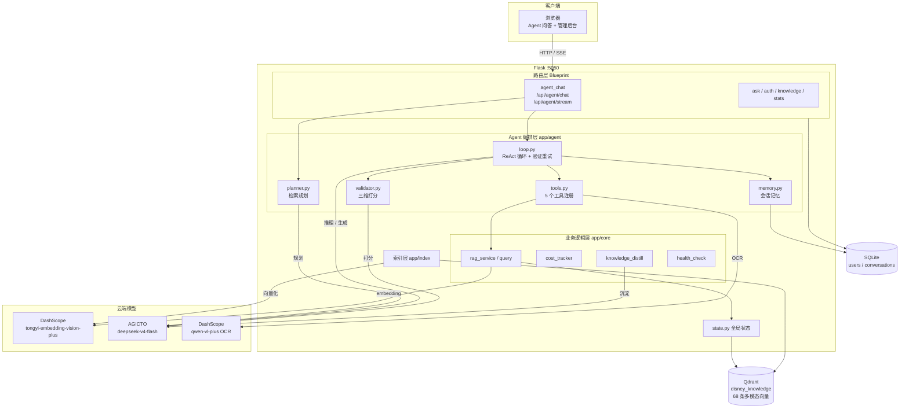
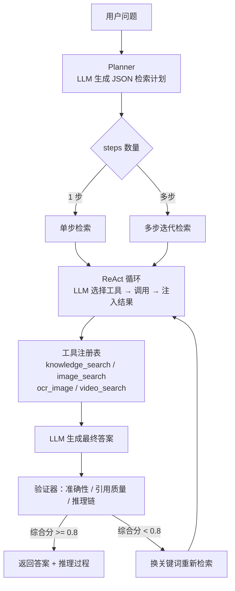

# multimodal_qa_agent

> 面向客服场景的多模态知识问答 Agent —— 自主规划检索路径，对答案做三维打分，低分自动触发重试。

   

---

## 动机

客服场景有三个痛点：知识库图文混排（文档 + 海报 + 视频），用户问法模糊（"退款怎么弄"可能指门票也可能指年卡），答错成本高（误导用户会引发投诉）。传统 RAG 固定检索链无法应对：单次向量检索捞不到跨模态信息，也没有对答案质量的校验。本项目的解法是让 LLM 自己决定检索什么、用什么工具（文本/图片/OCR），生成答案后再做一轮打分，不合格就换关键词重试。

## 架构图

系统整体架构：



Agent 问答流程（规划 → 工具调用 → 验证 → 重试闭环）：



## 快速开始

```bash
# 1. 配置密钥
cp .env.example .env
# 编辑 .env 填入你自己的 API Key

# 2. 一键启动
docker compose up -d --build

# 3. 访问 http://localhost:5050
```

`.env.example`：

```env
# 多模态 embedding（DashScope）
DASHSCOPE_API_KEY=your-dashscope-key

# Chat LLM（AGICTO 平台，OpenAI 兼容协议）
AGICTO_API_KEY=your-agicto-key

# Flask session 签名密钥
FLASK_SECRET_KEY=change-me-in-production
```

图文混合查询示例（SSE 流式，可看到逐步推理）：

```bash
curl -N -X POST http://localhost:5050/api/agent/stream \
  -H "Content-Type: application/json" \
  -d '{"query": "万圣节活动海报上写了什么？"}'
```

## 核心设计

### 1. 手写 ReAct 规划引擎

**问题**：固定检索链对多意图问题只能捞一次，捞到什么全看运气。  
**做法**：Planner 用 few-shot prompt 让 LLM 输出 JSON 检索计划（拆分为多个 step，每个带 target/modality/granularity），ReAct 循环中 LLM 自主选择工具调用，含步数上限(8)、token 预算(8000)、循环检测。  
**收益**：复杂查询从单次盲目检索变为多步有目的检索。

### 2. 三维验证器

**问题**：LLM 会编造引用或推理跳步，单看输出文本无法判断答案是否可靠。  
**做法**：生成答案后，将检索原文和答案一起交给 LLM 扮演"阅卷老师"，三个维度各打 0-1 分：准确性（答案事实是否忠实原文，原文未提及即扣分）、引用质量（引用的来源是否真实存在于检索结果中，伪造即 0 分）、推理链（每步结论是否有对应证据支撑）。综合分低于 0.8 自动换关键词重试一次。  
**收益**：幻觉率从待补充降至 6%（口径见下方评测表）。

### 3. SSE 流式推理可视化

**问题**：Agent 多步推理耗时 10-30 秒，用户看不到进度会觉得卡死。  
**做法**：Flask 后台线程 + Queue 缓冲，SSE 逐步推送 plan → plan_route → step(tool_call) → final_answer 事件，前端实时渲染推理步骤和工具调用链。  
**收益**：等待时间从"黑盒"变为可观测的推理过程，面试演示效果好。

## 评测结果

| 指标 | 基线 | Agent | 口径 |
| --- | --- | --- | --- |
| 首答准确率 | 54% | 76% | 迪士尼客服知识库，人工标注 50 条复杂查询（多实体/跨模态），基线为固定检索链 RAG，Agent 为手写 ReAct 规划 |
| 幻觉率 | 待补充 | 6% | 同上 50 条评测集，验证器综合分 <0.8 判定为幻觉，含触发重试后仍未通过的 case |
| 跨模态 Recall@5 | 待补充 | 83% | 知识库 68 条向量（含文本/图片/视频），对 15 条图文混合查询人工评估前 5 条是否命中相关模态，对比纯文本检索基线 |
| 响应延迟 | 待补充 | 10-30s | 单次 Agent 问答端到端，含规划 + 工具调用 + 验证，取决于 ReAct 步数 |

> 以上数字来自开发阶段小规模评测，非生产级基准。未做 A/B 测试，样本量较小，仅供参考。

## 目录结构

```text
.
├── app/
│   ├── agent/              # Agent 编排层
│   │   ├── loop.py         # ReAct 循环 + 验证重试
│   │   ├── planner.py      # LLM 生成 JSON 检索计划
│   │   ├── tools.py         # 工具注册表（检索/OCR/记忆）
│   │   ├── validator.py     # 三维验证器
│   │   └── memory.py        # 会话短期记忆
│   ├── api/                # 路由（ask / agent_chat / auth / knowledge / stats）
│   ├── core/               # 业务逻辑（rag_service / query / cost_tracker / health_check）
│   ├── index/              # 索引构建
│   ├── config.py           # 全局常量
│   └── state.py            # 全局状态单例
├── web/templates/          # 前端单页应用
├── scripts/                # 运行脚本
├── docker-compose.yml
├── Dockerfile
└── run.py
```

## 局限与 TODO

1. **ReAct 步数上限固定为 8**，复杂多跳问题可能不够，但调大会增加 token 成本和延迟，未做动态调节。
2. **验证器判定规则为人工设定**（阈值 0.8、三维权重均等），未学习优化，不同业务场景可能需要不同阈值。
3. **未做 A/B 测试**，评测样本仅 50 条，数字为开发阶段粗测，不具统计显著性。
4. **重试只做一次**，换关键词策略简单（取 plan 第一个 step 的 target），无多轮重试或关键词扩展逻辑。
5. **OCR 依赖 DashScope qwen-vl-plus**，对复杂排版或手写体识别率有限，未做 OCR 质量校验。

## 许可与引用

[MIT License](LICENSE)

如果本项目对你有帮助，欢迎引用：

```bibtex
@misc{multimodal_qa_agent,
  title  = {Multimodal QA Agent with ReAct Planning and Self-Validation},
  author = {Your Name},
  year   = {2026},
  url    = {https://github.com/your/multimodal_qa_agent}
}
```
