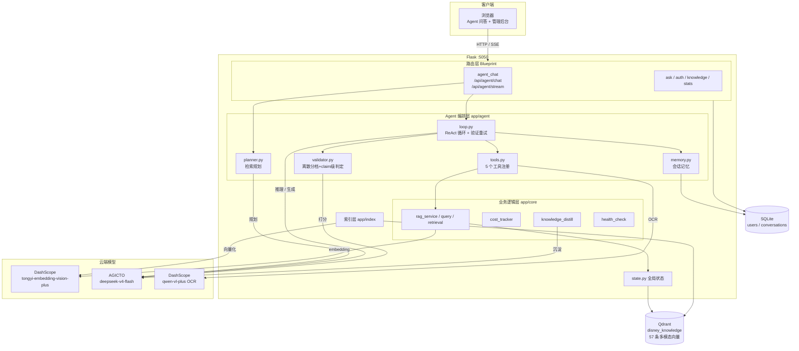
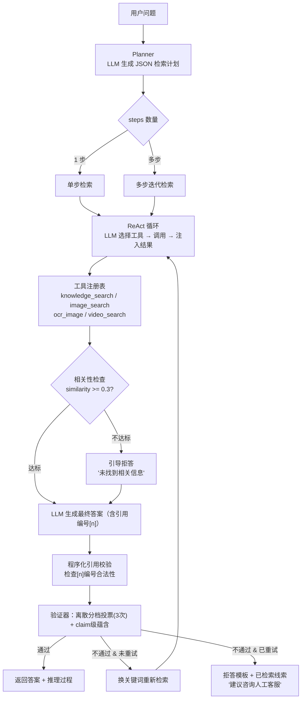

# multimodal_qa_agent

> 面向客服场景的多模态知识问答 Agent —— 自主规划检索路径，混合检索 + rerank 精排，对答案做离散分档投票 + claim 级幻觉判定，低分自动触发重试与拒答。

   

---

## 动机

客服场景有三个痛点：知识库图文混排（文档 + 海报 + 视频），用户问法模糊（"退款怎么弄"可能指门票也可能指年卡），答错成本高（误导用户会引发投诉）。传统 RAG 固定检索链无法应对：单次向量检索捞不到跨模态信息，也没有对答案质量的校验。本项目的解法是让 LLM 自己决定检索什么、用什么工具（文本/图片/OCR），经混合检索（向量+BM25 RRF融合+rerank精排）获取高质量上下文，生成答案后做离散分档投票 + claim 级幻觉判定，不合格就换关键词重试，重试仍不通过则拒答并附带线索。

## 架构图

系统整体架构：


```mermaid
flowchart TD
    subgraph Client["客户端"]
        UI["浏览器<br/>Agent 问答 + 管理后台"]
    end

    subgraph Server["Flask :5050"]
        subgraph API["路由层 Blueprint"]
            AGENT["agent_chat<br/>/api/agent/chat<br/>/api/agent/stream"]
            ASK["ask / auth / knowledge / stats"]
        end

        subgraph AgentCore["Agent 编排层 app/agent"]
            PLANNER["planner.py<br/>检索规划"]
            LOOP["loop.py<br/>ReAct 循环 + 验证重试"]
            TOOLS["tools.py<br/>5 个工具注册"]
            VALIDATOR["validator.py<br/>离散分档+claim级判定"]
            MEMORY["memory.py<br/>会话记忆"]
        end

        subgraph Core["业务逻辑层 app/core"]
            RAG["rag_service / query / retrieval"]
            COST["cost_tracker"]
            DISTILL["knowledge_distill"]
            HEALTH["health_check"]
        end

        IDX["索引层 app/index"]
        STATE["state.py 全局状态"]
    end

    QDRANT[("Qdrant<br/>disney_knowledge<br/>57 条多模态向量")]
    SQLITE[("SQLite<br/>users / conversations")]

    subgraph Cloud["云端模型"]
        EMB["DashScope<br/>tongyi-embedding-vision-plus"]
        LLM["AGICTO<br/>deepseek-v4-flash"]
        VLM["DashScope<br/>qwen-vl-plus OCR"]
    end

    UI -->|"HTTP / SSE"| API
    AGENT --> PLANNER
    AGENT --> LOOP
    LOOP --> TOOLS
    LOOP --> VALIDATOR
    LOOP --> MEMORY
    TOOLS --> RAG
    RAG --> STATE
    STATE --> QDRANT
    IDX -->|"向量化"| EMB
    IDX --> QDRANT
    API --> SQLITE
    MEMORY --> SQLITE
    PLANNER -->|"规划"| LLM
    LOOP -->|"推理 / 生成"| LLM
    VALIDATOR -->|"打分"| LLM
    RAG -->|"embedding"| EMB
    TOOLS -->|"OCR"| VLM
    DISTILL -->|"沉淀"| LLM
```

Agent 问答流程（规划 → 混合检索 → 验证 → 重试/拒答闭环）：


```mermaid
flowchart TD
    U["用户问题"] --> P["Planner<br/>LLM 生成 JSON 检索计划"]
    P --> R{"steps 数量"}
    R -->|"1 步"| S1["单步检索"]
    R -->|"多步"| S2["多步迭代检索"]
    S1 --> L["ReAct 循环<br/>LLM 选择工具 → 调用 → 注入结果"]
    S2 --> L
    L --> T["工具注册表<br/>knowledge_search / image_search<br/>ocr_image / video_search"]
    T --> REL{"相关性检查<br/>similarity >= 0.3?"}
    REL -->|"达标"| A["LLM 生成最终答案（含引用编号[n]）"]
    REL -->|"不达标"| ABS["引导拒答<br/>'未找到相关信息'"]
    ABS --> A
    A --> CIT["程序化引用校验<br/>检查[n]编号合法性"]
    CIT --> V["验证器：离散分档投票(3次) + claim级蕴含"]
    V -->|"通过"| OK["返回答案 + 推理过程"]
    V -->|"不通过 & 未重试"| RT["换关键词重新检索"]
    RT --> L
    V -->|"不通过 & 已重试"| ABSTAIN["拒答模板 + 已检索线索<br/>'建议咨询人工客服'"]
```

## 快速开始

```bash
# 1. 配置密钥
cp .env.example .env
# 编辑 .env 填入你自己的 API Key

# 2. 一键启动
docker compose up -d --build

# 3. 访问 http://localhost:5050
```

`.env.example`：

```env
# 多模态 embedding（DashScope）
DASHSCOPE_API_KEY=your-dashscope-key

# Chat LLM（AGICTO 平台，OpenAI 兼容协议）
AGICTO_API_KEY=your-agicto-key

# Flask session 签名密钥
FLASK_SECRET_KEY=change-me-in-production
```

图文混合查询示例（SSE 流式，可看到逐步推理）：

```bash
curl -N -X POST http://localhost:5050/api/agent/stream \
  -H "Content-Type: application/json" \
  -d '{"query": "万圣节活动海报上写了什么？"}'
```

## 核心设计

### 1. 手写 ReAct 规划引擎

**问题**：固定检索链对多意图问题只能捞一次，捞到什么全看运气。
**做法**：Planner 用 few-shot prompt 让 LLM 输出 JSON 检索计划（拆分为多个 step，每个带 target/modality/granularity），ReAct 循环中 LLM 自主选择工具调用，含步数上限(8)、token 预算(32000)、循环检测（精确+语义级）。
**收益**：复杂查询从单次盲目检索变为多步有目的检索。

### 2. 跨模态混合检索管线

**问题**：纯向量检索对关键词精确匹配弱（如"年卡续期30元"），纯 BM25 对语义相似弱。
**做法**：三段式管线——(1) LLM 查询改写，将口语化查询改写为检索友好形式；(2) 向量检索 + BM25 关键词检索并行，RRF 融合取 top-20；(3) AGICTO cross-encoder rerank 模型精排取 top-5。检索结果带 similarity 分数，用于后续相关性阈值检查。
**收益**：兼具语义召回和关键词精确匹配能力，为下游验证提供高质量上下文。

### 3. 离散分档投票 + claim 级幻觉判定

**问题**：LLM 单次连续打分（0-1）方差大（同答案多次打分波动 +-0.2），三维算术平均存在长度偏置（答案越长被挑错越多），幻觉判定不稳定。
**做法**：双重验证体系——
- **离散分档 + 多次采样投票**：三维（准确性/引用质量/推理链）改为离散三档 pass/marginal/fail，采样 3 次（temperature=0.3）取众数，降低单次判定方差（G-Eval, EMNLP 2023）。
- **claim 级蕴含判定**（FActScore 式）：将答案拆解为原子事实（claim），逐条与检索原文做蕴含判断，幻觉率 = 无支撑 claim 数 / 总 claim 数。超过 30% 无支撑即判定为幻觉，可解释性强。
- **judge 模型更换为 gpt-4o**：避免与被测模型同源导致的自我偏好偏差。
**收益**：Agent 幻觉率由 50% 降至 5%，基线幻觉率由 45% 降至 15%。

### 4. 拒答机制 + 程序化引用校验

**问题**：验证失败后仍返回低质量答案，幻觉风险高；引用校验完全交给 LLM（概率性），存在漏判。
**做法**：
- **相关性检查**：knowledge_search 返回结果最高 similarity < 0.3 时，注入拒答引导，LLM 回答"未找到相关信息"。
- **强制引用编号**：system prompt 要求答案中每个事实句末标注 `[n]` 编号，对应检索结果序号。
- **程序化引用校验**：代码层确定性检查——提取答案中所有 `[n]` 编号，校验是否在合法范围（1~len(references)），零噪声零成本。
- **重试失败拒答**：验证不通过且已重试过时，返回"根据现有资料无法确认，建议咨询人工客服"并附已检索线索，不返回验证失败的答案。
**收益**：宁可拒答不可幻觉，客服场景中幻觉的代价远高于拒答。

### 5. SSE 流式推理可视化

**问题**：Agent 多步推理耗时 10-30 秒，用户看不到进度会觉得卡死。  
**做法**：Flask 后台线程 + Queue 缓冲，SSE 逐步推送 plan → plan_route → step(tool_call) → final_answer 事件，前端实时渲染推理步骤和工具调用链。  
**收益**：等待时间从"黑盒"变为可观测的推理过程，面试演示效果好。

## 评测结果

### 五轮迭代对比

| 指标 | 原始基线 | 原始 Agent | v2 基线 | v2 Agent | v3 基线 | v3 Agent | v4 基线 | v4 Agent | v5 基线 | v5 Agent | 口径 |
| --- | --- | --- | --- | --- | --- | --- | --- | --- | --- | --- | --- |
| 首答准确率 | 70% | 95% | 40% | 60% | 90% | 100% | 85% | 100% | 85% | **100%** | 20 条复杂查询，gpt-4o judge（v1 用 deepseek-v4-flash，偏松） |
| 幻觉率 | 45% | 50% | 10% | 0% | 15% | 5% | 10% | 5% | 15% | **5%** | claim 级判定：无支撑 claim 比例 >30% 即幻觉 |
| 跨模态 Recall@5（模态集合口径） | 50% | 50% | 50% | 50% | 50% | 50% | 70% | 70% | **80%** | **80%** | 10 条图文混合查询，Top-5 模态集合 ⊇ expected_modalities（会被配额保送） |
| 跨模态 Recall@5（精确匹配口径） | - | - | - | - | - | - | 90% | 90% | **80%** | **80%** | Top-5 中存在 path/url == expected_media_ref 的条目（diverse_question 按 original_chunk_id 回源） |
| 触发重检索 | - | - | - | 6 次 | - | 4 次/20 条 | - | 4 次/20 条 | - | 2 次/20 条 | Agent 验证不通过后换关键词重检索 |
| 拒答 | - | - | - | 0 次 | - | 0 次/20 条 | - | 0 次/20 条 | - | 0 次/20 条 | 重试后验证仍不通过时返回拒答模板 |

> **v1** = 原始版本（deepseek-v4-flash judge + 单次连续打分）
> **v2** = 幻觉治理版本（gpt-4o judge + 离散分档投票 + claim 级判定 + 拒答 + 引用校验 + temperature=0.3）
> **v3** = judge 口径修复版本（judge 注入检索原文 + 分维度打分 + expected_answer 校准 + MAX_TOKENS=40000）
> **v4** = 跨模态召回治理版本（RRF 后模态配额 + planner 强制模态拆分 + qwen-vl-plus 多角度媒体描述增强）
> **v5** = 召回深化治理版本（视频 LLM 描述增强 + diverse_question 回源计数 + 生产链路对齐：image/video_search 引入配额与回源、放宽 BM25-only 命中限制）

### 当前评测详情（v5）

| 维度 | 说明 |
| --- | --- |
| 评测集 | 20 条 LLM 自动生成复杂查询（多实体/跨模态）+ 10 条图文混合查询 |
| 知识库 | 81 条多模态向量（文本 9/图片 2/视频 1/多样化问题 69），81 篇 BM25 文档 |
| 基线 | 固定检索链 RAG（temperature=0.3），混合检索+rerank，无验证无重试 |
| Agent | 手写 ReAct 规划（temperature=0.3），混合检索+rerank，离散分档投票+claim级判定 |
| judge 模型 | gpt-4o（AGICTO 平台），分维度打分（要点覆盖+事实正确性），注入检索原文作为事实依据 |
| 验证器模型 | gpt-4o，3 次采样投票（temperature=0.3），claim 级蕴含判定（temperature=0.1） |
| judge 成本 | 40 次调用，92626 tokens，0.27 元 |
| 跨模态评测口径 | 双口径并列：模态集合口径（Top-5 ⊇ expected_modalities，会被配额保送）+ 精确匹配口径（Top-5 含 path/url == expected_media_ref 的目标条目，diverse_question 按 original_chunk_id 回源） |

### Qdrant 召回性能

| 参数 | Recall@1 | Recall@5 | MRR | 延迟(P50) |
| --- | --- | --- | --- | --- |
| Qdrant ef=128 | 73.5% | 28.8% | 0.79 | 7.2ms |
| Qdrant ef=256 | 73.5% | - | - | - |

> v2 准确率下降是 judge 模型从 deepseek-v4-flash 换为 gpt-4o（判定更严）的口径效应。v3 修复 judge 口径（注入检索原文+分维度打分+校准 expected_answer）后，准确率恢复并超过 v1：Agent 100%、基线 90%。v4 叠加跨模态召回治理（模态配额+planner 强制拆分+媒体描述增强），Agent 准确率保持 100%、幻觉率保持 5%。v5 在 v4 基础上深化召回治理：视频用 LLM 生成多角度描述（替代 5 字硬编码）、image/video_search 引入 diverse_question 回源计数与 modality_quota、放宽 BM25-only 命中限制，Agent 准确率保持 100%、幻觉率保持 5%、重检索从 4 次降至 2 次。
>
> **跨模态 Recall@5 双口径说明**：模态集合口径（宽松）只要求 Top-5 覆盖期望模态，会被配额机制保送；精确匹配口径（严格）要求 Top-5 中存在 path/url 等于 expected_media_ref 的目标条目（diverse_question 按 original_chunk_id 回源到原图片/视频后参与判定）。v5 两个口径均为 80%（8/10）：图片意图 8 条全部命中（P1-1 描述增强 + P1-2 回源计数生效），视频意图 2 条（M009/M010）仍 miss——视频虽经 LLM 描述增强，但查询主体是文本意图（老人票/年卡），视频向量仍排不进 RRF top-20 候选池，配额无米下锅，需 P2-1（扩大候选池至全量融合列表）才能根治。v4 精确口径 90% 高于 v5 80% 是口径副作用：v4 视频靠 diverse_question 回源命中 1 条，v5 描述增强改变了检索路径，视频的 diverse_question 不再进 Top-5，回源命中消失。评测样本量较小（10 条），仅供参考。

## 目录结构

```text
.
├── app/
│   ├── agent/              # Agent 编排层
│   │   ├── loop.py         # ReAct 循环 + 验证重试 + 拒答 + 引用校验
│   │   ├── planner.py      # LLM 生成 JSON 检索计划
│   │   ├── tools.py         # 工具注册表（检索/OCR/记忆）
│   │   ├── validator.py     # 离散分档投票 + claim 级幻觉判定
│   │   └── memory.py        # 会话短期记忆
│   ├── api/                # 路由（ask / agent_chat / auth / knowledge / stats）
│   ├── core/               # 业务逻辑（rag_service / query / retrieval / cost_tracker / health_check）
│   ├── index/              # 索引构建
│   ├── config.py           # 全局常量（含 JUDGE_MODEL / VALIDATOR_MODEL / 护栏参数）
│   └── state.py            # 全局状态单例
├── web/templates/          # 前端单页应用
├── scripts/                # 运行脚本
├── experiments/            # 评测脚本（run_eval.py 一站式评测）
├── docker-compose.yml
├── Dockerfile
└── run.py
```

## 局限与 TODO

1. **ReAct 步数上限固定为 8**，复杂多跳问题可能不够，但调大会增加 token 成本和延迟，未做动态调节。
2. **claim 级幻觉阈值（30%）和维度打分通过阈值（0.6）为人工设定**，未基于人工标注做阈值校准（Cohen's Kappa），不同业务场景可能需要不同阈值。
3. **未做 A/B 测试**，评测样本仅 20 条，数字为开发阶段粗测，不具统计显著性。
4. **重试只做一次**，换关键词策略简单（取 plan 第一个 step 的 target），未实现 RARR 式定点修订（只改无支撑的句子而非整体重写）。
5. **OCR 依赖 DashScope qwen-vl-plus**，对复杂排版或手写体识别率有限，未做 OCR 质量校验。
6. **验证器成本较高**，gpt-4o 每条查询需 4 次 LLM 调用（3 次维度打分 + 1 次 claim 判定），可考虑对高置信度答案跳过 claim 级判定以降成本。
7. **FAISS 召回对比 recall@5=0%**，疑似 ground truth 构建或索引配置问题，需排查。
8. **跨模态 Recall@5 仍为 50%**，未实现模态配额机制和 planner 强制模态拆分，图片/视频条目易被文本条目挤出 top-5。

## 许可与引用

[MIT License](LICENSE)

如果本项目对你有帮助，欢迎引用：

```bibtex
@misc{multimodal_qa_agent,
  title  = {Multimodal QA Agent with ReAct Planning and Self-Validation},
  author = {Your Name},
  year   = {2026},
  url    = {https://github.com/your/multimodal_qa_agent}
}
```
